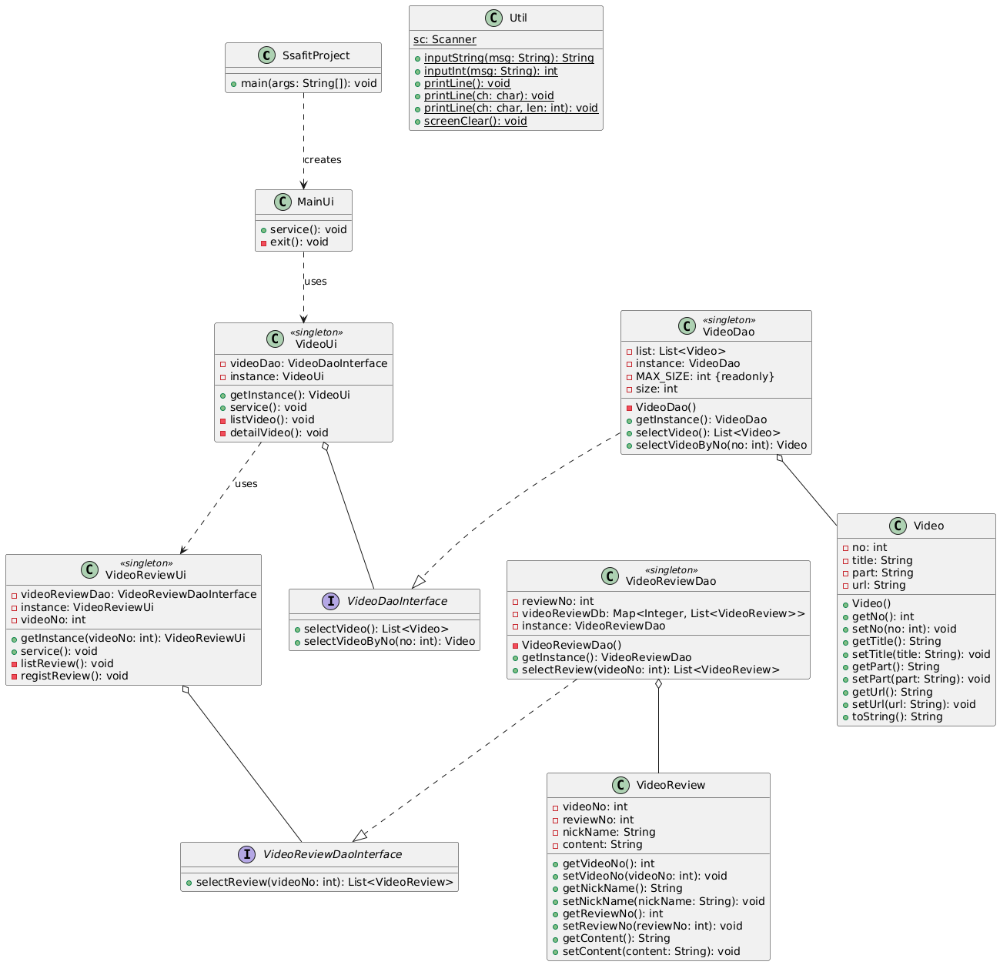

# 1차 관통 PJT 회고록

## 1. PJT 진행 방법

이번 프로젝트에서 레포지토리의 폴더 생성 기준에 대한 팀원 간 혼동으로 인해 이슈가 발생했던 경험을 바탕으로, 다음과 같은 개선된 방법을 적용했습니다:

- 프로젝트 시작 전 팀원들과 함께 폴더 구조와 네이밍 컨벤션에 대한 명확한 가이드라인 설정
- 가이드라인을 문서화하여 모든 팀원이 쉽게 참조할 수 있도록 함
- 정기적인 코드 리뷰를 통해 일관성 유지
- 프로젝트 초기에 샘플 폴더 구조를 만들어 공유

이러한 방법을 통해 팀원 간 혼란을 최소화하고 일관된 프로젝트 구조를 유지할 수 있었습니다.

## 2. 협업 방법

Git 브랜치 전략을 활용하여 효율적인 협업을 진행했습니다:

1. `master` 브랜치 아래에 `dev` 브랜치 생성
2. `dev` 브랜치에서 각자 `feature` 브랜치를 만들어 작업
3. 작업 완료된 `feature` 브랜치는 `dev`에 머지
4. 머지 후 해당 `feature` 브랜치 삭제
5. 로컬의 브랜치도 `git branch -D` 명령어로 삭제
6. `dev` 브랜치를 최신 상태로 업데이트
7. 새로운 `feature` 브랜치를 생성하여 다음 작업 시작

이 방식을 통해 깔끔한 브랜치 관리와 효율적인 협업이 가능했습니다.

## 3. 명세 해석

명세 해석 및 구현 범위 설정:

- 기본 기능만을 설계 및 구현하기로 결정
- 중복되는 기능을 Util 클래스로 분리하여 코드 재사용성 향상
- 구현 범위:
  - 영상정보의 R(Read) 기능
  - 리뷰의 C(Create), R(Read) 기능

클래스 다이어그램 작성 및 개선:

- 명세를 바탕으로 클래스 다이어그램 작성
- GPT를 활용한 다이어그램 검토 및 개선사항 도출
- GPT 제안 사항:
  - 인터페이스 사용 권장
  - 의존성 주입 개선
  - 데이터 유효성 검사 강화
  - 예외 처리 개선

plantUML 툴을 통해 다음과 같은 클래스 다이어그램을 도출해내었습니다.

## 4. 기능 기획 및 구현
